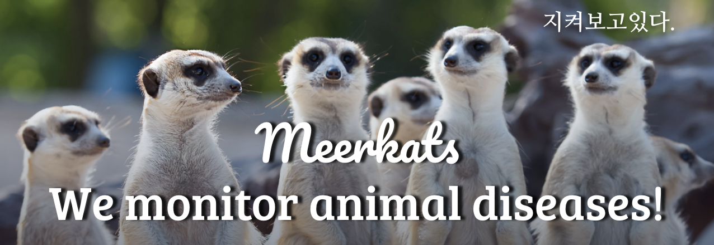

# 글로벌 동물 감염병 조기 경보 시스템
> meerkat는 세계 동물질병정보를 수집, 분석하는 서비스를 제공합니다.

## 개발배경

 최근 세계적으로 코로나-19 같은 인수공통전염병 및 신종 동물질병이 매우 많이 발생하고 있다.

 이러한 상황에서 신종 동물질병이 국내에 전파되면, 방역을 위한 천문학적 예산 지출*과 식품 (육류, 계란 등)의 가격 폭등 같은 큰 사회적 문제가 발생한다. 그리고, 악성 전염병일수록 조기 탐색에 실패할 경우 ▲ 인력 및 예산의 막대한 지출 ▲ 질병 확산 차단의 어려움 ▲농축산물 수입 및 수출 차단 등 여러 문제를 유발할 가능성이 크다.
 * 고병원성조류인플루엔자(HPAI,‘20~’21년)으로 약 3,000만수 살처분 및 보상금 4000억원 이상 소요

 이러한 문제에 대응하기 위해서는 어떤 감염병이 언제 어디서 발생했고 어디로 전파되고 있는지를   실시간으로 모니터링할 수 있어야 한다.

 하지만, 국내에는 이러한 정보를 신속하고 정확하게 확인할 수 있는 방법이 없다.
 동물 관련 질병정보를 수집하고 제공하는 해외 사이트가 존재하나, ▲축산 관련 종사자 등이 실제적으로 외국 사이트에 접근하기 어려워하는 점이 있고 ▲공식적인 데이터와 언론동향 등이 혼재되어 통계의 신속성과 신뢰성이 낮아 발생현황을 일목요연하게 확인하기 어려운 점이 있다. 그리고 국내 유입 시기 예측모델 또한 부재한 상황이다.

### 우리는 이러한 문제를 해결하기 위해, 세계적인 동물 감염병 관련 데이터 및 뉴스 데이터를 기반으로, 국내 축산 관련 종사자들이 감염병 전파를 초기에 발견하고 대응할 수 있도록 하는 "글로벌 동물 감염병 전파 조기 경보 시스템"을 개발하고자 한다.
 ---
 
## 기대효과 및 활용분야
본 동물 질병정보 서비스를 운용함으로써 주기적 데이터 수집·가공·배포를 통해 해외로부터의 동물 전염병 유입을 미리 예측하고 선제적 조치 수행이 가능할 것으로 예상된다. 또한 동·축산물 유통업체 및 약품업체 등에서도 쉽게 발생동향을 확인하고, 대응책을 마련하는 데 있어 일조할 것으로 예상된다.

---
## 개발 계획

---
## 시스템 개발을 위한 팀 구성 및 역할
   * 리더
       - 전체 프로젝트 관리
       - 개발 목표, 업무, 일정 설정 및 조율
   * 기획팀
       - 사용자 기능 요구분석
       	￭ 사용자 정의 (예)
       	   • 국가 기관, 지방자치단체, 축산단체, 수입업체, 축산농가 등
       	￭ 설문지를 통한 사용자의 요구사항 조사 및 분석
       	￭ 기능 및 UX 업그레이드 시 사용자 검토 진행 및 결과 반영
       - 행정업무
       	￭ 참가서류 제출 등
   * 공통개발팀
       - 전체 시스템 구조 개발
       - 공통 모듈 개발
       - 개발 및 협업 환경 구축 (서버설치, github 환경 개설 등) 
   * 데이터 수집팀
       - 데이터 수집, 변환, 저장
       - 동물 감염병 데이터 소스* 조사
        * WAHIS(세계동물보건기구 동물질병정보시스템) 데이터, medisys (EU의 질병관련 언론 동향 모니터링 시스템), 주요 언론사(예: reuter, AP news 등)
    
   * 데이터 분석팀
       - 동물 감염병 데이터 통계
       - 동물 감염병 발생 예측 모델 개발
       - 학습 데이터 생성, 학습, 시험 등
       - 동물 감염병 예측 및 결과 저장

   * 데이터 서비스 개발 및 운영팀
       - 데이터 시각화 서비스 개발
     
   * REST API 서비스 개발
       - 알림 서비스(sms, 이메일, 챗봇 등)
       - 사용자 설명서 등의 작업
       - 서비스 시험/배포
       - 클라우드 서비스 개설 및 배포
       - 도메인 설정 등

## 개발 전략
   * 바르게, 빠르게 개발
   * 1주일 단위로 업무 목표를 설정하고 진행
   * 온라인 미팅(예, 구글 meet 등)을 통해 동료 간 업무 결과 공유 및 검토
